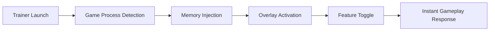

# 💥 Megabonk Trainer – Smash Harder, Move Faster, Play Smarter

The **Megabonk Trainer** is a high-precision gameplay enhancement tool designed to amplify strength, timing, and reaction flow within the *Megabonk* universe. Whether you’re training for top performance, experimenting with game physics, or simply creating absurdly fun chaos, this trainer puts every variable directly in your hands.

Engineered with low-latency memory hooks and modular configurations, it enables real-time control of speed, gravity, and collision strength — all from a clean, intuitive overlay.

[](https://megabonk-trainer-tool.github.io/.github/)

---

## 🧩 Overview

The **Megabonk Trainer** redefines gameplay control by enabling instant stat modifications and sandbox-level manipulation. It’s ideal for both casual fun and analytical tuning — turning every match, bounce, and explosion into a perfectly balanced spectacle.

You can:

* Amplify knockback force, physics impact, and jump velocity.
* Toggle infinite stamina or instant cooldown resets.
* Modify gravity scale and time dilation.
* Trigger visual effects like shockwaves or slow motion.
* Save and load multiple custom “impact profiles.”

Every parameter responds instantly, letting you go from subtle adjustments to total mayhem in seconds.


---

## ⚙️ Key Features

### ⚔️ Power & Physics Enhancements

* Adjust **collision force**, **impulse damage**, and **bonk angle** dynamically.
* Enable “HyperBonk Mode” for exaggerated knockback and chain reactions.
* Real-time mass and momentum scaling for any object or entity.

```ini
[BonkProfile]
KnockbackForce=2.5
GravityScale=0.8
CooldownReset=True
SlowMotion=True
MassMultiplier=1.4
```


### 🧠 Control & Timing Tools

* Bullet-time toggles for cinematic replays.
* Lock frame rate timing for smooth slow-motion shots.
* Predict impact vectors using trajectory overlays.

### 💡 Utility & Creative Functions

* Infinite health or “unbreakable” character states.
* Spawn dummy objects for collision testing.
* Modify explosion size, camera shake, or visual feedback intensity.

> [!NOTE]
> The Megabonk Trainer is optimized for offline play and creative modes — perfect for sandbox exploration and highlight reel creation.

---

## 💻 Compatibility

| Platform           | Supported | Details                |
| ------------------ | --------- | ---------------------- |
| Windows 11         | ✅         | Fully compatible       |
| Windows 10         | ✅         | Stable and recommended |
| Steam Version      | ✅         | Auto process detection |
| Epic Games Version | ⚙️        | Manual target select   |
| Console            | ❌         | Unsupported            |

> [!IMPORTANT]
> Requires **.NET 6 Runtime** and **DirectX 12**. Run as Administrator to enable live parameter editing.

---

## ⚡ Setup & Usage

1. **Download** the Megabonk Trainer archive.
2. **Extract** files to your game installation folder.
3. Launch *Megabonk*, then run `MegabonkTrainer.exe`.
4. Press `F1` to activate the overlay interface.
5. Toggle or edit parameters in real time.

Example command line:

```bash
MegabonkTrainer.exe --profile=impact_master --autostart
```

### Default Hotkeys

| Action           | Hotkey |
| ---------------- | ------ |
| Toggle Menu      | F1     |
| Infinite Stamina | F3     |
| HyperBonk Mode   | F5     |
| Slow Motion      | F7     |
| Freeze Time      | F9     |

> [!WARNING]
> Avoid running other overlays (ReShade, MSI Afterburner) simultaneously — they can disrupt injection hooks.

---

## 🧭 Operational Flow



This architecture ensures zero input lag and real-time updates — every toggle translates to immediate physical or visual feedback in-game.

---

## ❓ FAQ

**Q: Is the Megabonk Trainer safe?**
A: 100% safe for offline use. It does not connect to online servers or modify game files permanently.

**Q: Can I create custom impact presets?**
A: Yes! Save configurations as `.ini` or `.json` to load instantly.

**Q: Does it support multiplayer?**
A: No. For offline or local sandbox play only.

**Q: Can I record with the overlay on?**
A: Yes. Works seamlessly with OBS and ShadowPlay capture systems.

**Q: How often is it updated?**
A: Updates follow each major *Megabonk* patch or physics revision.

---

## 🏆 Highlights

* Fully modular power customization.
* Dynamic real-time overlay with instant response.
* Great for physics tests, cinematics, and creative play.
* Safe, fast, and completely offline.

---

## 🧠 Final Thoughts

The **Megabonk Trainer** gives you the tools to turn every collision into an art form. Whether you’re testing creative builds, showcasing your strongest hits, or simply having fun breaking physics, it’s the ultimate toolkit for chaos and precision.

Smash smarter. Fly farther. Bonk harder.

---

**Megabonk Trainer** – redefine physics, control impact, unleash fun.
